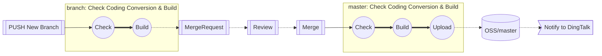
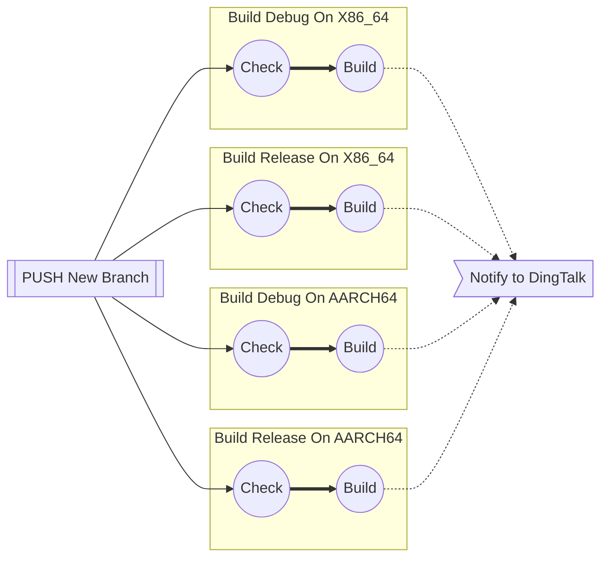
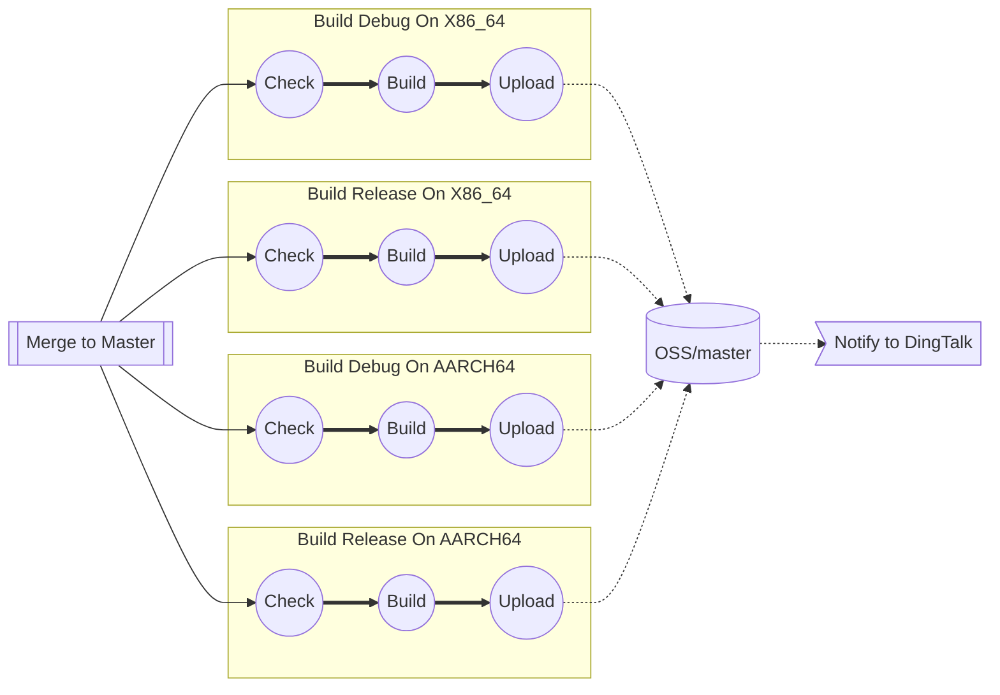
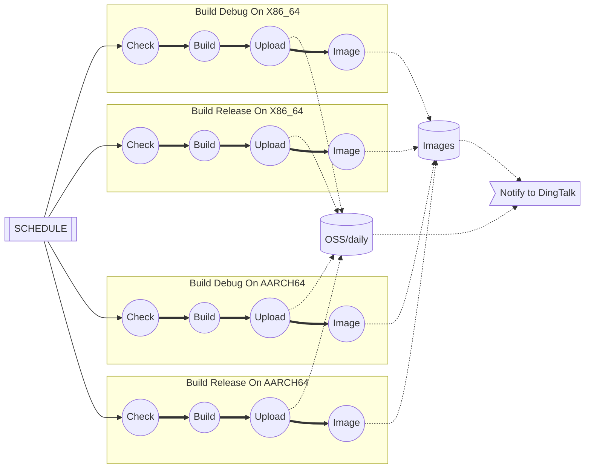
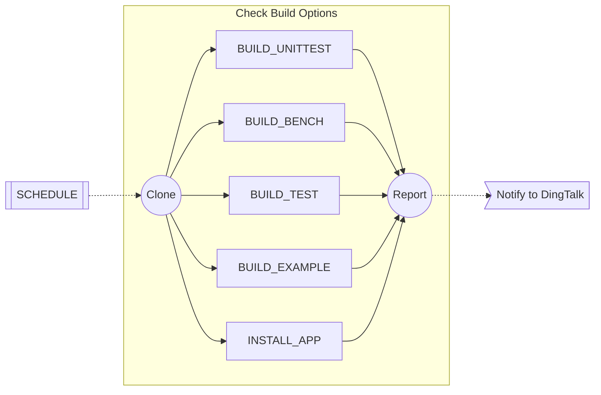
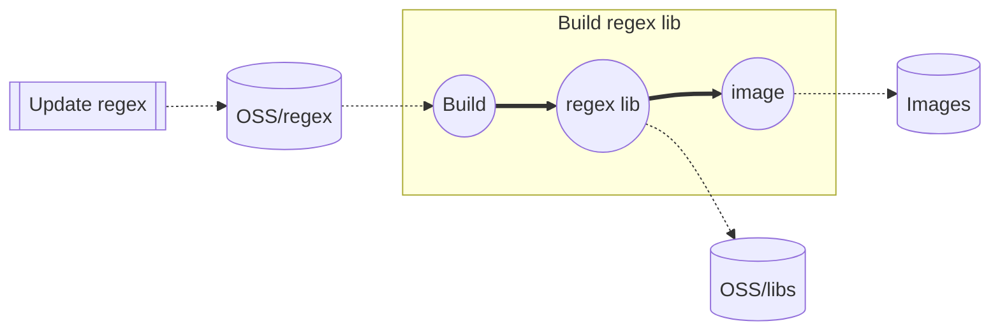
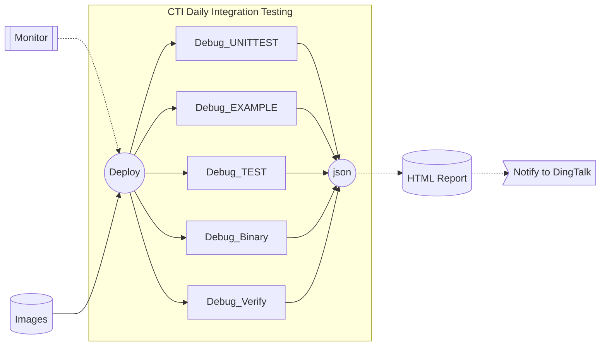
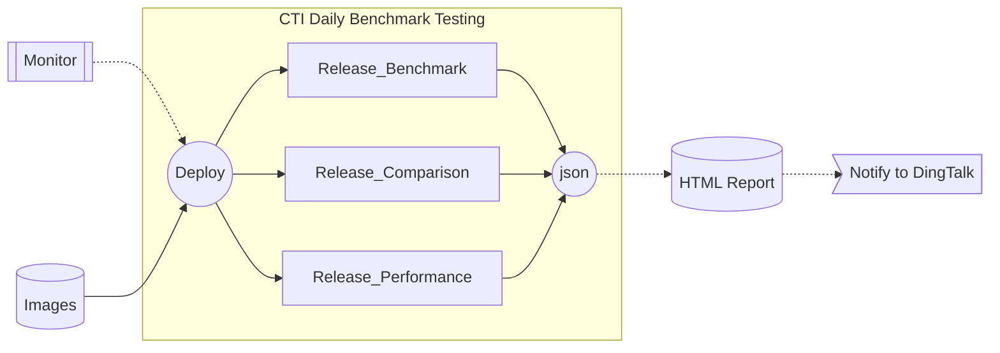

# ACI Pipeline Design and Implementation

**Important**: Markdown file (.md) is the master copy. PDF file (.pdf) is exported from markdown file only for review.

## Revision History

|Version|Author     |Date      |Description|
|-------|-----------|----------|-----------|
|0.1    |linjie.xiao|2023.08.10|Initial version.|
|0.2    |linjie.xiao|2023.11.06|Add Integration & Performance Testing |

## Introduction
This design document mainly describes the input and output states of each stage of the pipeline and the main Pipeline in the ACI automation CI/CD environment. These include Push/PullRequest, Daily Build, Daily Offline Test, Code Style Check, and Check Build Options.

## Push/PullRequest Pipeline

- Total Push/PullRequest Pipeline

- Push Pipeline

- Merge to Maser Pipeline

## Daily Build Pipeline

- Build Daily Package Pipeline

- Check Build Options Pipeline

- Check Regex with Coding Conversion

## CTI Daily Test Pipeline

- CTI Daily Integration Testing

- CTI Daily Benchmark Testing

