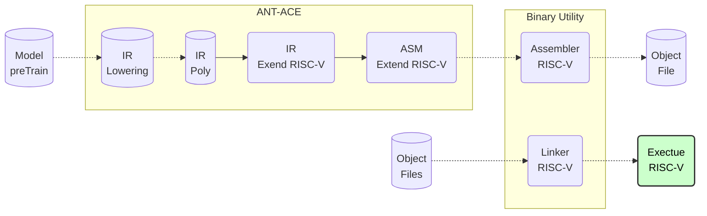

# CodeGen Design and Implementation

**Important**: Markdown file (.md) is the master copy. PDF file (.pdf) is exported from markdown file only for review.

## Revision History

|Version|Author     |Date      |Description|
|-------|-----------|----------|-----------|
|0.1    |linjie.xiao|2024.08.29|Initial version.|

## Introduction
This design document mainly describes the process involves the pre-trained model undergoing 5 layers of IR lowering to generate polyIR, which is then converted to RISC-V assembly instructions through CGIR. Finally, the assembler and linker are used to produce a RISC-V executable program.

- [Pipeline Flow chart](./CodeGen.html)

## CI: Push/PullRequest Pipeline

