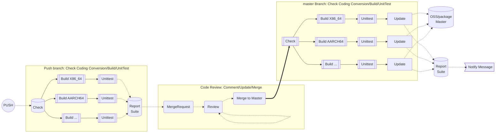
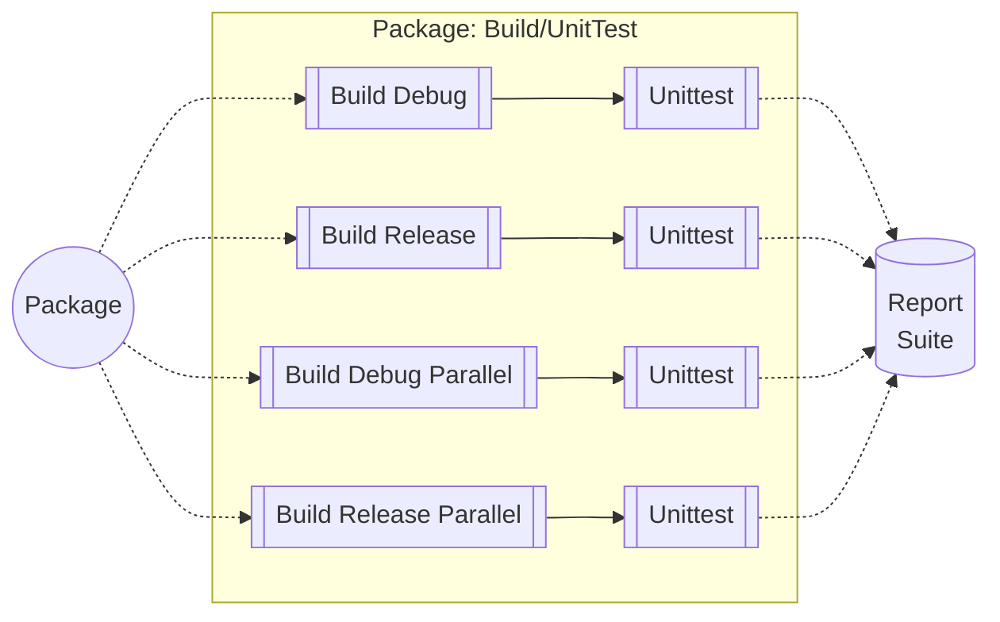
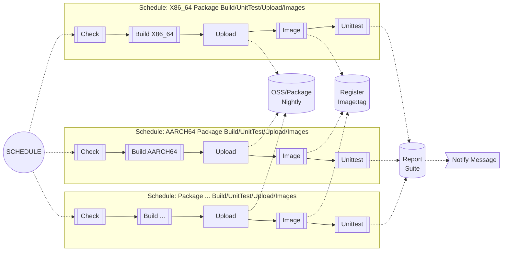
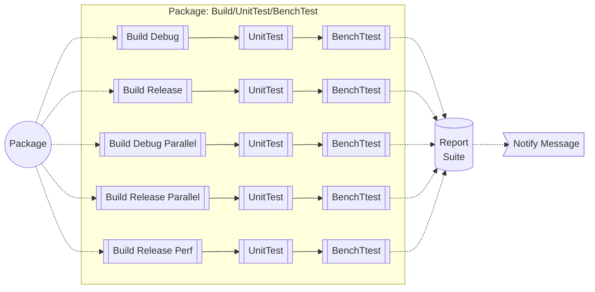
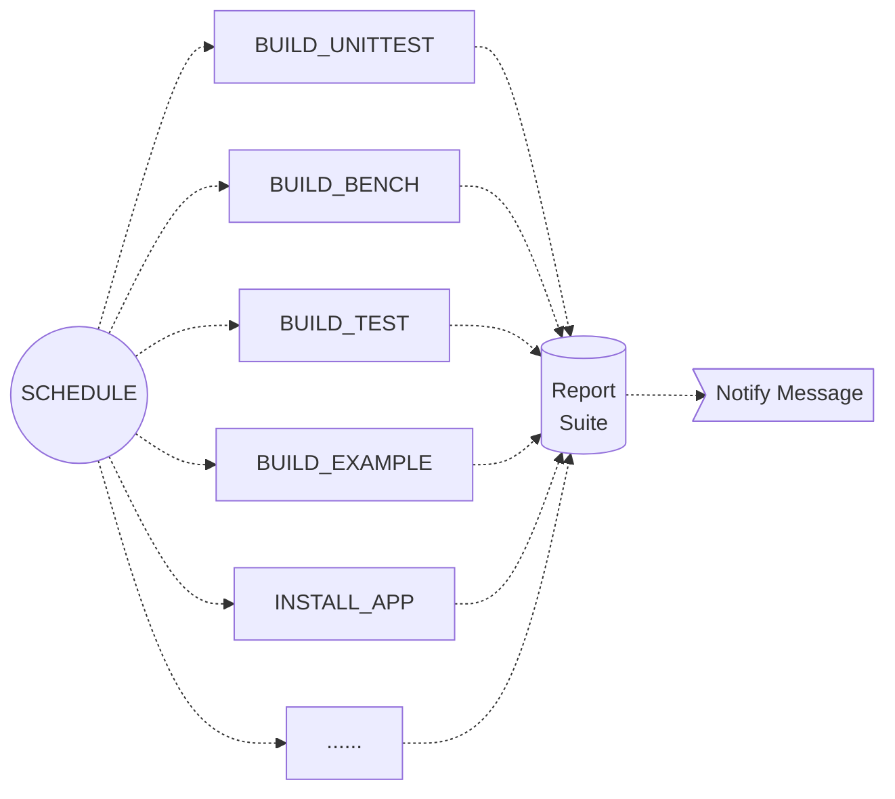
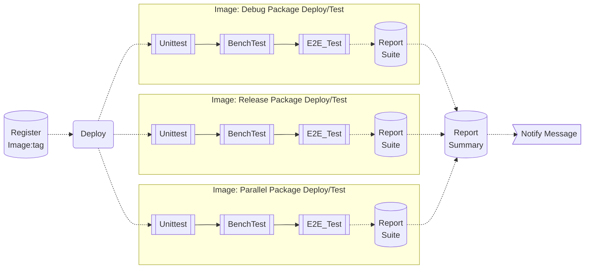
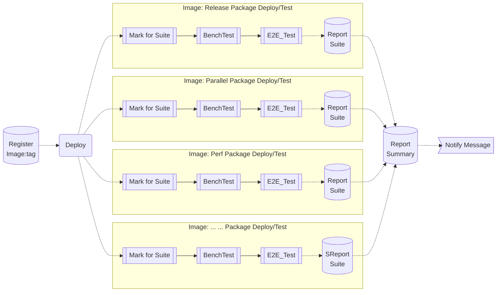

# ACI Pipeline Design and Implementation

**Important**: Markdown file (.md) is the master copy. PDF file (.pdf) is exported from markdown file only for review.

## Revision History

|Version|Author     |Date      |Description|
|-------|-----------|----------|-----------|
|0.1    |linjie.xiao|2023.08.10|Initial version.|
|0.2    |linjie.xiao|2023.11.06|Add Integration & Performance Testing |
|0.3    |linjie.xiao|2024.07.31|Improve CICD Pipeline |

## Introduction
This design document mainly describes the input and output states of each stage of the pipeline and the main Pipeline in the ACI automation CI/CD environment. These include Push/PullRequest, Daily Build, Daily Offline Test, Code Style Check, and Check Build Options.

- [Pipeline Flow chart](./PipelineACI.html)

## CI: Push/PullRequest Pipeline

- Pipeline for Push/PullRequest

- SubPipeline for Package Build & UnitTest

## CI: Nightly Schedule Pipeline

- Pipeline for Nightly Package Build & Unittest, Image Build

- SubPipeline for Package Build & UnitTest & BenchTest

- Pipeline for Build Options Check

## CD: Nightly/Weekly Test Pipeline

- Pipeline for Nightly Package Test

- Pipeline for Nightly/Weekly Benchmark Test

