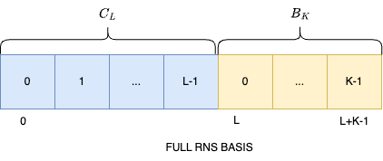
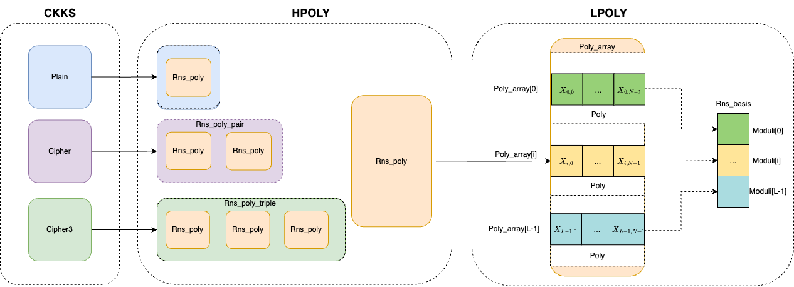

# Poly Level IR Design and Implementation

## Revision History
|Version|Author     |Date      |Description|
|-------|-----------|----------|-----------|
|0.1    |Qing Zhu|2024.11.06|Initial version|
|0.2    |Qing Zhu|2024.11.14|Update Types|
|0.3    |Qing Zhu|2024.11.25|Update attributes and operator constraints|

## Introduction
Poly IR serves as an abstraction for representing Fully Homomorphic Encryption (FHE) programs that utilize polynomial arithmetic. Encryption related data such as CKKS Ciphertext(Type Cipher), CKKS Ciphertext3(the result of Cipher-Cipher multiplication, Type Cipher3), and CKKS Plaintext(Type Plain) are translated into their underlying polynomial representations and operations. Specifically, a CKKS Plain is represented as a single polynomial, a CKKS Cipher is represented as a pair of polynomials, and a CKKS Cipher3 is represented as three polynomials.

Building on the concept of multi-level intermediate representations (IR), which is essential in contemporary compiler design and offers numerous advantages to improve the compilation process, we have defined HPOLY IR and LPOLY IR to represent polynomial computations. HPOLY IR is intended for expressing high-level Residue Number System (RNS) polynomial operations, with the computation unit being Rns_poly. cdThe LPOLY representation will be mapped to hardware operations during the code generation phase or directly invoked through ACE runtime library calls.

## Notions
This section will describe the basic notions used in the document.

**RNS basis**

RNS, or Residue Number System, is a non-weighted number system that represents integers using a set of residues with respect to a given set of moduli. The key idea is to decompose a number into its residues modulo several pairwise coprime integers (moduli), allowing for efficient arithmetic operations, especially in the context of computer arithmetic and cryptography.

The RNS basis refers to the selection of the set of moduli used to represent numbers in the Residue Number System. The choice of moduli affects the efficiency and performance of the arithmetic operations performed in that number system.

In CKKS scheme, two RNS basis are choosed when setup, one is the $\mathcal{C}_L$ for Q RNS basis $\{q_0...q_{L-1}\}$, and another is $\mathcal{B}_K$ for P RNS basis $\{p_0...p_{K-1}\}$. L is the maximum number of q primes, and K is the total number of p primes. 

We define global RNS basis index ranges from [0, L + K - 1] for the full RNS basis. Each RNS based polynomial's basis ranges should be subset of this range.

  

**Scaling factor**

The scaling factor $\Delta$ in CKKS is typically a power of two, denoted as $2^s$, where $s$ is a non-negative integer. It is used to scale the plaintext values before they are encrypted and to control the precision of subsequent operations on the ciphertexts.

During multiplication of two ciphertexts, the noise associated with the result will typically increase, and the scaling factor may need to be adjusted. The multiplication of two scaled ciphertexts results in a new ciphertext that has an increased scaling factor $2^{s_1 + s_2}$ (assuming $s_1$ and $s_2$ were the original scaling factors).

To keep the result manageable, the result may need to be rescaled to a smaller scaling factor.

After performing operations like multiplication, rescaling is performed to reduce the scaling factor (and consequently the noise). This involves dividing the ciphertext by the scaling factor (which is a power of two), effectively reducing the noise level and making it possible to continue computations without exceeding the noise threshold.


## Types and Attributes

```
<Type>            ::= <Primitive> | <Array_type> | <Ckks_type> | <Hpoly_type> | <Lpoly_type>

<Primitive>       ::= Integer | Float | Bool

<Array_type>      ::= <Type>[]

<Ckks_type>       ::= Cipher | Cipher3 | Plain

<Hpoly_type>      ::= <Rns_poly_triple> ｜ <Rns_poly_pair> | Rns_poly

<Lpoly_type>      ::= <Poly_array> ｜ Poly | Crt_prime

<Rns_poly_pair>   ::= {Rns_poly, Rns_poly}

<Rns_poly_triple> ::= {Rns_poly, Rns_poly, Rns_poly}

<Poly_array>      ::= Poly[]
```

In HPOLY layer, we offer three types: **Rns_poly**, **Rns_poly_pair**, **Rns_poly_triple**. These denote an RNS based polynomial type, a pair of Rns_poly and a triple of Rns_poly type respectively.

In LPOLY Layer, we offer three types: **Poly_array**, **Poly**, **Crt_prime**. These correspond to the array of polynomial types, the polynomial type itself, and the CRT prime type, which is used for modulus operations and NTT conversions.

The Type lowering from CKKS to LPOLY is outlined in below figure. When converting from CKKS to HPOLY, a Plain type is transformed into an Rns_poly type, while a Cipher type is converted into an Rns_poly_pair type, which consists of a pair of Rns_poly and Cipher3 types. The Cipher3 type is further lowered to an Rns_poly_triple type, composed of a triple of Rns_polys.

In the transition from HPOLY to LPOLY, the Rns_poly type is lowered to a Poly_array type, which is formed by an array of Polys. The size of this array is determined by the HPOLY attributes **num_q** and **num_p**, calculated through static analysis. It is important to note that the array size may be unknown; for instance, this can occur when a function call has different attributes for the arguments at the call site.



* CKKS Attributes
  |Attributes|Constraints|Description|
  |-------|-----------|-----------|
  |slots|$slots \le N/2$|ciphertext slots
  |sfactor|$log_2(sfactor) < Max\_bits$|scaling factor|
  |sdeg|$sdeg \ge 1$ && <br>$log_2(sfactor)*sdeg <Max\_bits$|scaling degree
  |level|$0 \le level \le L (?)$|ciphertext level
  
  $Max\_bits = log_2(q_0) + (L - 1) * log_2(sfactor)$
  
* HPOLY Attributes
  |Attributes|Constraints|Description|
  |-------|-----------|-----------|
  |$num\_q$|$0 \le num\_q \le L$|number of q primes in current Rns_poly node|
  |$num\_p$|$num\_p ==0\ or \ num\_p == K$ | number of p primes|
  |$s\_basis$|$0 \leq s\_basis \lt L + K$|the start index of RNS basis in current Rns_poly node|
  |$is\_ntt$|$is\_ntt == true\|false$| the format of Rns_poly node<br>true for NTT format<br> false for COEFF format

  For $\forall x \in Rns\_poly$ type, we define $x.size = x.num\_q + x.num\_p$, the following rules must be satisfied:
  $$ x.s\_basis + x.size \le L + K $$

* LPOLY Attributes
  |Attributes|Constraints|Description|
  |-------|-----------|-----------|
  |$is\_ntt$|$is\_ntt == true\|false$| the format of Poly node<br>true for NTT format<br> false for COEFF format|
  |$s\_basis$|$0 \leq s\_basis \lt L + K$ |the start index of RNS basis in Poly_array node|

The attributes will be annotated or propagated down from CKKS to LPOLY layer.

## Major Operators
* HPOLY Operators

  |Operator|Types|Constraints|Description|
  |-------|-----------|-----------|----------|
  |extract x y z| x,res $\in$ Rns_poly, y, z $\in$ Integer| $0 \le y \lt x.size$ <br> $y \le z \lt  x.size$ |extract POLYs from x start from index y to z |
  |switch_basis x y z| x, res $\in$ Rns_poly,  y, z $\in$ Integer|$0 \le y \lt L + K$ <br>$y \le z \lt L + K$ |switch x's RNS basis to range [y,z]|
  |concat x y| x, y, res $\in$ Rns_poly|$y.s\_basis == x.s\_basis + x.size$ |concat x and y|
  |add x y|x, res $\in$ Rns_poly, y $\in$ Rns_poly \| Integer \| Array_type{Integer}|1) if $y \in$ Rns_poly<br>  $x.s\_basis == y.s\_basis$<br>$x.num\_q == y.num\_q$<br>2) if $y \in$ Array_type{Integer}<br> $y.size == x.num\_q$  |add Rns_poly within Q RNS basis $\mathcal{C}_L$ |
  |add_ext x y|x, res $\in$ Rns_poly, y $\in$ Rns_poly \| Integer \| Array_type{Integer}|1) if $y \in$ Rns_poly<br>  $x.num\_p == K$<br> $x.s\_basis == y.s\_basis$<br> $x.num\_q == y.num\_q$ <br> $x.num\_p == y.num\_p$<br>2) if $y \in$ Array_type{Integer}, $y.size == x.size$  | add Rns_poly within extended RNS basis $\mathcal{C}_L\mathcal{B}_K$|
  |sub x y|x, res $\in$ Rns_poly, y $\in$ Rns_poly \| Integer \| Array_type{Integer}| 1) if $y \in$ Rns_poly<br>  $x.s\_basis == y.s\_basis$<br>$x.num\_q == y.num\_q$<br>2) if $y \in$ Array_type{Integer}<br> $y.size == x.num\_q$  |substract Rns_poly within Q RNS basis $\mathcal{C}_L$|
  |sub_ext x y|x, res $\in$ Rns_poly, y $\in$ Rns_poly \| Integer \| Array_type{Integer}|1) if $y \in$ Rns_poly<br>  $x.num\_p == K$<br> $x.s\_basis == y.s\_basis$<br> $x.num\_q == y.num\_q$ <br> $x.num\_p == y.num\_p$<br>2) if $y \in$ Array_type{Integer}, $y.size == x.size$ |substract Rns_poly within extended RNS basis $\mathcal{C}_L\mathcal{B}_K$|
  |mul x y|x, res $\in$ Rns_poly, y $\in$ Rns_poly \| Integer \| Array_type{Integer}| 1) if $y \in$ Rns_poly<br>  $x.s\_basis == y.s\_basis$<br>$x.num\_q == y.num\_q$<br>2) if $y \in$ Array_type{Integer}<br> $y.size == x.num\_q$  | multiply Rns_poly within Q RNS basis $\mathcal{C}_L$ |
  |mul_ext x y|x, res $\in$ Rns_poly, y $\in$ Rns_poly \| Integer \| Array_type{Integer}| 1) if $y \in$ Rns_poly<br>  $x.num\_p == K$<br> $x.s\_basis == y.s\_basis$<br> $x.num\_q == y.num\_q$ <br> $x.num\_p == y.num\_p$<br>2) if $y \in$ Array_type{Integer}, $y.size == x.size$ | multiply Rns_poly within extended RNS basis $\mathcal{C}_L\mathcal{B}_K$|
  |auto x y|x, res $\in$ Rns_poly, y $\in$ Array_type{Integer}|$y.size == N$|Performs automorphismTransform for x with order y at RNS_basis $\mathcal{C}_L$
  |auto_ext x y|x, res $\in$ Rns_poly, y $\in$ Array_type{Integer}|$y.size == N$<br>$x.num\_p==K$|Performs automorphismTransform for x with order y at extended RNS basis $\mathcal{C}_L\mathcal{B}_K$
  |ntt x| x, res $\in$ Rns_poly|$x.is\_ntt == false$ |convert x to NTT format
  |intt x|x, res $\in$ Rns_poly|$x.is\_ntt == true$ |convert x from NTT format to COEFFCIENT format
  |rescale x|x, res $\in$ Rns_poly|$x.num\_q > 1$<br>$x.num\_p==0$<br>$x.s\_basis == 0$ | scale down x with scaling factor
  |modswitch x|x, res $\in$ Rns_poly|$x.num\_q > 1$<br>$x.num\_p==0$|drop the last RNS basis
  |**kswprecom*** x|x $\in$ Rns_poly, res $\in$ Array_type{Rns_poly}|$x.num\_q > 0$ |key switch precomputation
  |**dotprod*** x, y |x, y $\in$ Array_type{Rns_poly}, res $\in$ Rns_poly|$x.size == y.size$<br> $x.elem.s\_basis == y.elem.s\_basis$<br>$x.elem.num\_q == y.elem.num\_q$ <br>$x.elem.num\_p == y.elem.num\_p$  |performs $\sum_{i=0}^{x.size-1}x_i * y_i$
  |**moddown*** x|x, res $\in$ Rns_poly|$x.num\_p == K$<br> $x.num\_q > 0$ | reduce x’s RNS basis
  |**extend*** x|x, res $\in$ Rns_poly| $x.num\_p == 0$<br> $x.num\_q > 0$ | extend x's RNS basis|

  Note: Operator with "*" will be continously lowered to HPOLY basic operators(with out *)


* LPOLY Operators

  |Operator|Types|Constraints|Description|
  |-------|-----------|----------|----------|
  |alloc_n x y| x,y $\in$ Integer, res $\in$ Poly_array|$x > 0$| allocate a Poly array of size x, RNS basis start from y|
  |free_n x |x $\in$ Poly_array|| free the memory of x|
  |size x|x $\in$ Poly_array, res $\in$ Integer|| Returns the length of x|
  |s\_basis x|x $\in$ Poly_array, res $\in$ Integer||Returns the start index of Rns_basis of x|
  ||
  |alloc| res $\in$ Poly| |allocate a Poly |
  |free x|x $\in$ Poly|| free Poly|
  |add x y z|x, res $\in$ Poly, y $\in$ Poly\| Integer, z $\in$ Crt_prime |x.is_ntt == y.is_ntt <br> x.size == y.size<br>x.s_basis = y.s_basis (y $\in$Poly)|for each coefficients in x and y performs $(x_i + y_i) \mod z$
  |sub x y z|x, res $\in$ Poly, y $\in$ Poly\| Integer, z $\in$ Crt_prime |x.is_ntt == y.is_ntt <br> x.size == y.size<br>x.s_basis = y.s_basis (y $\in$Poly) |for each coefficients in x and y performs $(x_i - y_i) \mod z$
  |mul x y z |x, res $\in$ Poly , y $\in$ Poly\| Integer, z  $\in$ Crt_prime |x.is_ntt == y.is_ntt <br> x.size == y.size<br>x.s_basis = y.s_basis (y $\in$Poly)|for each coefficients in x and y performs $(x_i * y_i) \mod z$
  |auto x y z|x, res $\in$ Poly, y $\in$ Array{Integer}, z $\in$ Crt_prime| |Performs automorphismTransform for x with order y|
  |raw_add x y|x, res $\in$ Poly , y $\in$ Poly\| Integer|x.is_ntt == y.is_ntt <br> x.size == y.size<br>x.s_basis = y.s_basis (y $\in$Poly)|for each coefficients in x and y performs $(x_i + y_i)$
  |raw_mul x y|x, res $\in$ Poly , y $\in$ Poly\| Integer| x.is_ntt == y.is_ntt <br> x.size == y.size<br>x.s_basis = y.s_basis (y $\in$Poly) |for each coefficients in x and y performs $(x_i * y_i)$
  |mod x y|x, res $\in$ Poly, y  $\in$ Crt_prime ||for each coefficients in x performs $(x_i \mod y)$
  |ntt x y| x, res $\in$ Poly, y $\in$ Crt_prime| x.is_ntt == false| convert x to NTT format at RNS level y|
  |intt x y |x, res $\in$ Poly, y $\in$ Crt_prime | x.is_ntt == true|convert x from NTT format to COEFFCIENT format at RNS level y|
  |set_ntt x y|x $\in$ Poly, y $\in$ Bool||set x to NTT format if y is true, otherwise  set x to COEFF format|
  |is_ntt x| x $\in$ Poly, res $\in$ Bool||check if x is in NTT format|
  |crtprime x|x $\in$ Integer, res $\in$ Crtprime|$0 \le x \lt L+K$|Returns the xth Crtprime

## IR Lowering
### CKKS2HPOLY Lowering
* CKKS2HPOLY Lower Mapping
  |CKKS Operator|HPOLY Operator|Lower Logic|
  |-------|-----------|----------|
  |ckks.add|hpoly.add|<pre><code>// z = ckks.add x y <br>// 1) y $\in$ Cipher <br>pz.first  = hpoly.add px.first py.first<br>pz.second = hpoly.add px.second py.second <br>// 2) y $\in$ Plain<br>pz.first  = hpoly.add px.first py.first<br>pz.second = px.second<br>// 3) y $\in$ Float<br>t = hpoly.encode(y, num_q, ...)<br>pz.first = hpoly.add px.first t<br>pz.second = px.second</code></pre>
  |ckks.sub|hpoly.sub|<pre><code>// z = ckks.sub x y <br>// 1) y $\in$ Cipher <br>pz.first  = hpoly.sub px.first py.first<br>pz.second = hpoly.sub px.second py.second <br>// 2) y $\in$ Plain<br>pz.first  = hpoly.sub px.first py.first<br>pz.second = px.second<br>// 3) y $\in$ Float<br>t = hpoly.encode(y, num_q, ...)<br>pz.first = hpoly.sub px.first t<br>pz.second = px.second</code></pre>
  |ckks.mul|hpoly.mul|<pre><code>// z = ckks.mul x y <br>// 1) y $\in$ Cipher <br>pz.first  = hpoly.mul px.first py.first<br>t1 = hpoly.mul px.first py.second <br>t2 = hpoly.mul px.second py.first<br>pz.second = hpoly.add t1 t2<br>pz.third = hpoly.mul px.second py.second<br>// 2) y $\in$ Plain<br>pz.first  = hpoly.mul px.first py.first<br>pz.second = hpoly.mul px.second py.first<br>// 3) y $\in$ Float<br>t = hpoly.encode(y, num_q, ...)<br>pz.first = hpoly.mul px.first t<br>pz.second = hpoly.mul px.second t</code></pre>
  |ckks.rescale|hpoly.rescale|<pre><code>//  z = ckks.rescale x <br>z.first = hpoly.rescale x.first<br>z.second = hpoly.rescale y.second</code></pre>
  |ckks.modswitch|hpoly.modswitch|<pre><code>//  z = ckks.rescale x <br>z.first = hpoly.rescale x.first<br>z.second = hpoly.rescale y.second</code></pre>
  |ckks.relin|hpoly.precomp<br>hpoly.dotprod<br>hpoly.add<br>hpoly.moddown|
  |ckks.rotate|hpoly.precomp<br>hpoly.dotprod<br>hpoly.add<br>hpoly.moddown<br>hpoly.rotate|
  |ckks.bootstrap|-|needs to be lowered to CKKS operators first|
  |ckks.encode|-|
  |ckks.upscale|-|

* H2LPOLY Lower Mapping
  |HPOLY Operator|LPOLY Operator|Lower Logic|
  |-------|-----------|----------|
  |hpoly.extract||<pre><code>// res = hpoly.extract(poly, start, end)<br>for (size_t idx = start; idx <= end; idx++) {<br>  res_arr[idx - start] = poly_arr[idx]; <br>}</code></pre>
  |hpoly.concat|lpoly.size|<pre><code>// res = hpoly.concat(poly1, poly2)<br>// poly1->poly1_arr, poly2->poly2_arr<br>size_t res_idx = 0;<br>for (size_t idx = 0; idx < lpoly.size(poly1_arr); idx++) {<br>  res_arr[res_idx++] = poly1_arr[idx]; <br>} <br>for (size_t idx = 0; idx < lpoly.size(poly2_arr); idx++) {<br>  res_arr[res_idx++] = poly2_arr[idx]; <br>} </code></pre>
  |hpoly.add|lpoly.add<br> lpoly.crtprime|<pre><code>// res = hpoly.add(poly1, poly2)<br>for (size_t idx = 0; idx < lpoly.size(res_arr); idx++) {<br>  assert(lpoly.is_ntt(poly1_arr[idx]) == lpoly.is_ntt(poly2_arr[idx]));<br>  Crtprime prime = lpoly.crtprime(idx + lpoly.basis(res_arr));<br>  res_arr[idx]= lpoly.add(poly1_arr[idx], poly2_arr[idx], prime);<br>  set_ntt(res_arr[idx], lpoly.is_ntt(poly1_arr[idx]));<br>}</code></pre>
  |hpoly.sub|lpoly.sub<br> lpoly.crtprime|<pre><code>// res = hpoly.sub(poly1, poly2)<br>for (size_t idx = 0; idx < lpoly.size(res_arr); idx++) {<br>  assert(lpoly.is_ntt(poly1_arr[idx]) == lpoly.is_ntt(poly2_arr[idx]));<br>  Crtprime prime = lpoly.crtprime(idx + lpoly.basis(res_arr));<br>  res_arr[idx]= lpoly.sub(poly1_arr[idx], poly2_arr[idx], prime);<br>  set_ntt(res_arr[idx], lpoly.is_ntt(poly1_arr[idx]));<br>}</code></pre>
  |hpoly.mul|lpoly.sub<br> lpoly.crtprime|<pre><code>// res = hpoly.mul(poly1, poly2)<br>for (size_t idx = 0; idx < lpoly.size(res_arr); idx++) {<br>  assert(lpoly.is_ntt(poly1_arr[idx]) == lpoly.is_ntt(poly2_arr[idx]));<br>  Crtprime prime = lpoly.crtprime(idx + lpoly.basis(res_arr));<br>  res_arr[idx]= lpoly.mul(poly1_arr[idx], poly2_arr[idx], prime);<br>  set_ntt(res_arr[idx], lpoly.is_ntt(poly1_arr[idx]));<br>}</code></pre>
  |hpoly.auto|lpoly.auto<br> lpoly.crtprime|<pre><code>// res = hpoly.auto(poly, order)<br>for (size_t idx = 0; idx < lpoly.size(res_arr); idx++) {<br>  Crtprime prime = lpoly.crtprime(idx + lpoly.basis(res_arr));<br>  res_arr[idx]= lpoly.auto(poly_arr[idx], order, prime); <br>  set_ntt(res_arr[idx], lpoly.is_ntt(poly_arr[idx]));}</code></pre>
  |hpoly.ntt|lpoly.auto<br> lpoly.crtprime|<pre><code>// res = hpoly.ntt(poly)<br>for (size_t idx = 0; idx < lpoly.size(res_arr); idx++) {<br>  assert(!lpoly.is_ntt(poly1_arr[idx]));<br>  Crtprime prime = lpoly.crtprime(idx + lpoly.basis(res_arr)); <br>  res_arr[idx]= lpoly.ntt(poly_arr[idx], prime);<br>  set_ntt(res_arr[idx], true); <br>}</code></pre>
  |hpoly.intt|lpoly.auto<br> lpoly.crtprime|<pre><code>// res = hpoly.intt(poly)<br>for (size_t idx = 0; idx < lpoly.size(res_arr); idx++) {<br>  assert(lpoly.is_ntt(poly1_arr[idx]));<br>  Crtprime prime = lpoly.crtprime(idx + lpoly.basis(res_arr)); <br>  res_arr[idx]= lpoly.intt(poly_arr[idx], prime);<br>  set_ntt(res_arr[idx], false); <br>}</code></pre>
  |hpoly.switch_basis|
  |hpoly.rescale|
