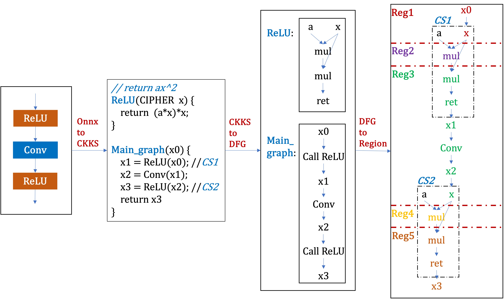

# ANT-ACE Region-based scale and bootstrapping management (RESBM) design and implementation

**Important**: Markdown file (.md) is the master copy. PDF file (.pdf) is exported from markdown file only for review.

## Revision History

|Version|Author     |Date      |Description|
|-------|-----------|----------|-----------|
|0.1    |Liu Yan| |Initial version.|

## Introduction
This document primarily describes the design and implementation details of RESBM in ANT-ACE. RESBM aims to manage the noise of ciphertexts that increases with Fully Homomorphic Encryption (FHE) operations, particularly multiplications. In the CKKS scheme, noise management is performed through bootstrapping, rescaling, modswitch, and other scale/level management operations.

In CKKS, the costs of FHE operations rise with the input ciphertext level. The insertion points of bootstrapping and rescaling operations significantly affect the overall latency of the generated FHE program. Firstly, they consume additional runtime. Secondly, these operations alter the ciphertext level and influence the costs of subsequent FHE operations.

RESBM is designed to insert bootstrapping and rescaling operations at positions that result in minimal overall latency.

## Analysis pass
A whole program analysis is performed to find the inserting positions of bootstrapping and rescaling. In detail, the analysis process composes of 2 steps:

**Create region:** Each region is a subgraph within the interprocedural Data Flow Graph (DFG). Each function's DFG is created independently of the calling context. We represent interprocedural nodes using a combination of the calling context and intraprocedural DFG node, referred to as REGION_ELEM, which is implemented in ckks/include/dfg_region.h.

As depicted in Figure 1, at each call site, the operands are linked to their corresponding formals, and the return node is connected to the returned variable of the call node (REGION_BUILDER::Link_formal). For instance, the operand x0 of the first ReLU is linked with the formal x, and the return node is linked with x1.

Regions are constructed using a forward and a backward pass on the interprocedural DFG. During the forward pass (REGION_BUILDER::Cal_mul_depth), the mul_depth of each node is set based on the number of multiplications from the program entry to the current node. During the backward pass (REGION_BUILDER::Opt_mul_depth), the mul_depth of a node is adjusted to the minimum value of its successors. If a successor is CKKS::mul, the mul_depth of the node is set to at least one less than that of the successor.

**Create minimal latency plan:** Minimal latency plan is created with a forward pass of the regions (RESBM::Cal_min_laten_plan). From the first region to the last one, take each region as the start region, and the region within *Lbts* mul_depth as the end region, where *Lbts* is the maximum resulting level of bootstrapping. Bootstrapping is inserted in the start region and the end region, rescaling is inserted in the regions among 
(*start*, *end*]. Let *Lbts*= 3, the program in Figure 1 will be analyzed with a sequence as following:
$$
\begin{aligned}
&[reg1, reg2] -> [reg1, reg3] -> [reg1, reg4] \\
&[reg2, reg3] -> [reg2, reg4] -> [reg2, reg5] \\
&[reg3, reg4] -> [reg3, reg5] \\
&[reg4, reg5] \\
\end{aligned}
$$

The insertion points for bootstrapping and rescaling are determined using the min-cut algorithm (implemented in ckks/include/min_cut_region.h). This selection aims to minimize latency within the candidate region. With the optimal bootstrapping and rescaling positions identified, the latency for each region is computed. Let *laten* denote the overall latency for regions between start and end, *laten_start* denotes the minimal latency from program entry to the start region. Then, the minimal latency from program entry to the end region is computed as follows:
$$
\begin{aligned}
  \boxed{laten_{end} = min(laten_{end}, laten + laten_{start})}
\end{aligned}
$$
If the minimal latency of the end region is reduced with the current start region, we update the optimal plan for the end region accordingly. Ultimately, the plan that results in the minimal latency for the final region is considered optimal. Bootstrapping and rescaling are then inserted based on this optimal plan.

## Tranform pass
**Insert bootstrapping/rescaling:** Bootstrapping and rescaling are inserted based on the optimal plan. For the entry function, bootstrapping is inserted directly. For other functions, clones are created for each bootstrapping/rescaling plan. At each call site, the called function is replaced with the version that matches the required plan.

For example, if bootstrapping is inserted in the second ReLU, the ReLU function will be cloned to a new function named ReLU_1 with the bootstrapping operation added. The called function at the second call site is then replaced with ReLU_1.
$$
\begin{aligned}
  Main&\_graph(x0) \{ \\
  &    x1 = ReLU(x0) \\
  &    x2 = Conv(x1) \\
  &    x3 = ReLU_1(x2)\\
  &    return x3 \\
  \} \\
\end{aligned}
$$

## Limitations
RESBM requires each data node to have a statically determined scale and level. Therefore, recursive functions that change ciphertext scale with each invocation are not supported. Similarly, loops in which the ciphertext scale increases with each iteration are also not supported. These loops must be unrolled prior to applying RESBM. 
$$
\begin{aligned}
  // let&\ ct\ be\ a\ ciphertext \\
  for &(uint\ i = 0; i < 3; ++i) \{ \\
    &ct = ct * ct; \\
  \} \\
\end{aligned}
$$
